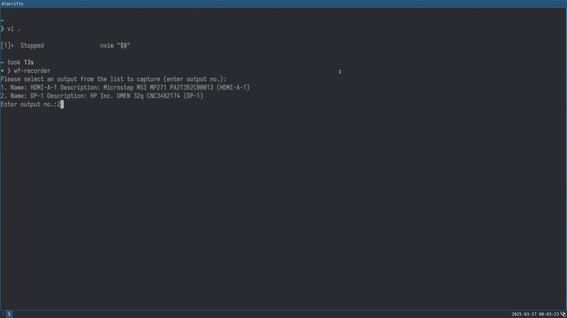

# hyprmag

A wlroots-compatible Wayland screen magnifier with basic customization options.



# Usage

Launch it. Trackpad pinch to zoom in/out. Move the mouse. That's it.

## Options

`-h | --help` prints a help message
`-r | --radius` sets the radius of the magnifying lens

# Building

Building is done via CMake:

```sh
cmake --no-warn-unused-cli -DCMAKE_BUILD_TYPE:STRING=Release -DCMAKE_INSTALL_PREFIX:PATH=/usr -S . -B ./build
cmake --build ./build --config Release --target hyprmag -j`nproc 2>/dev/null || getconf _NPROCESSORS_CONF`
```

Install with:

```sh
cmake --install ./build
```

# Caveats

"Freezes" your displays while magnifying.
